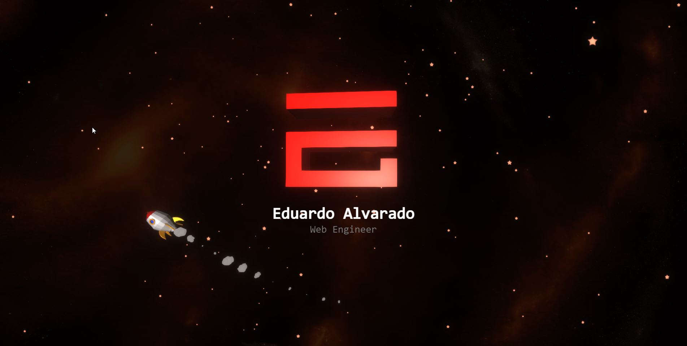

# Eduardo Alvarado - v2

This project is my second iteration of my personal website, built with Vue and ThreeJS. 

Previous iterations: [v1](https://github.com/eduardoalvara2/page-v1)



## Table of Contents
- [Code Usage](#code-usage)
- [Installation](#installation)
- [Project setup](#project-setup)


## Code Usage

This code represents a significant investment of time and effort on my part. Therefore, while you are welcome to use this code for your own projects, I kindly request that you provide attribution. This could be a mention in your project's README, a comment in your code, or any other form of acknowledgment.

Please include the following information in your attribution:

- Name: Eduardo Alvarado
- Link to original code: https://github.com/eduardoalvara2/page-v2

If you decide to use this code, I'd love to hear about it! Feel free to contact me and let me know.

## Installation

To start working with this project, you need to have Node.js and npm installed.

1. Clone the repository:
```bash
git clone https://github.com/eduardoalvara2/page-v2.git
```

2. Install dependencies:
```bash
cd page-v2
npm install
```

3. Start the local server:
```bash
npm run serve
```

4. And that's it, now the project is running on your localhost! You can visit http://localhost:8080 in your browser to view the site.

Other commands:

### Compiles and minifies for production
```
npm run build
```

### Lints and fixes files
```
npm run lint
```

## Color Palette:

| Color          | Hex                                                                |
| -------------- | ------------------------------------------------------------------ |
| Color 1           |  `#de2c24` |

## 


## Acknowledgements

I would like to express my deepest appreciation to the following developers who have inspired me throughout my journey in creating this website:

- [Brittany Chiang](https://brittanychiang.com): Her portfolio and creative ideas were a huge source of inspiration to me. I encourage everyone to check out her work.
- [Bruno Simon](https://bruno-simon.com): His innovative approach to web development and design has been truly enlightening and has helped shape the direction of this project.

Thank you for your amazing work and for continuing to inspire developers like me.
